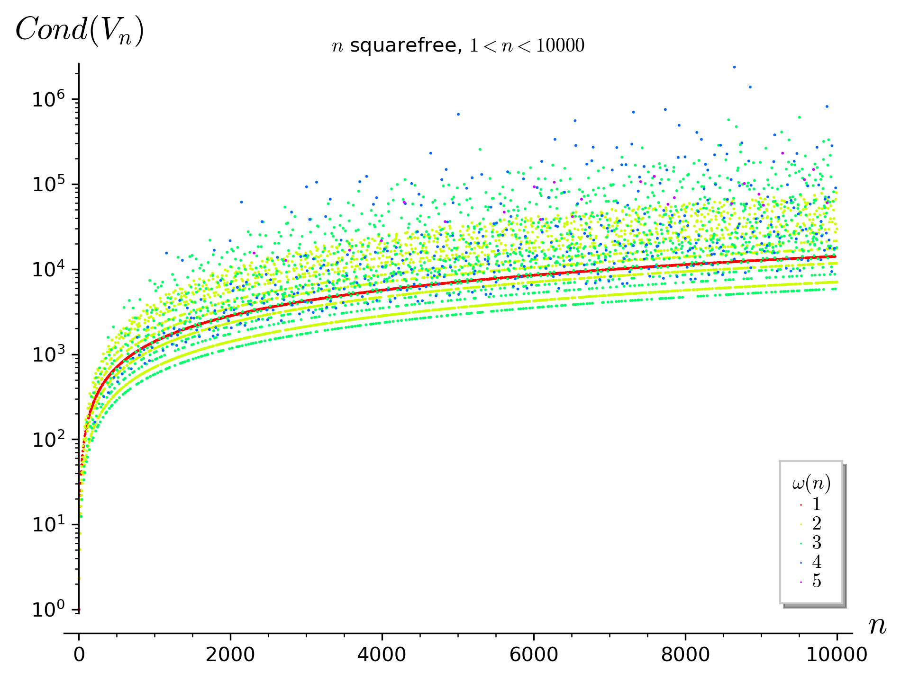

# Condition number of cyclotomic Vandermonde matrices

[](https://zenodo.org/badge/latestdoi/435289572)

Rust library associated to the article TBD.

Provides an efficient function to compute the condition number of *V_n*, the Vandermonde matrix associated with the *n*th cyclotomic polynomial.
The condition number is computed via the trace of the matrix *H_n*, as shown in [`DSS20`](https://doi.org/10.1515/jmc-2020-0009).

Contributors are:
- Antonio J. Di Scala
- Carlo Sanna
- Edoardo Signorini

## Installation

This crate can link with three LAPACK implementation. Default is Intel MKL. For more information on the supported features see [ndarray_linalg](https://github.com/rust-ndarray/ndarray-linalg).

To install clone the repository and build with cargo (release mode is recommended):

```sh
cargo build --release
```

## Usage

The library has a command line interface, which can be called via `cargo run`. There are two main commands `get` and` table`, visible via the `--help` option:

```sh
$ cargo run --release -- --help
cyclovander_cli 1.0.0

USAGE:
    cyclovander_cli [FLAGS] <SUBCOMMAND>

FLAGS:
    -h, --help       Prints help information
    -t, --trace      Compute trace instead of condition number
    -V, --version    Prints version information

SUBCOMMANDS:
    get      Output for integer n
    help     Prints this message or the help of the given subcommand(s)
    table    Generate table from file
```

Both commands have a global option `--trace`, which determines the computation of the trace of *H_n* rather than the condition number of *V_n*. The latter is calculated by default.

### Get

The `get` command returns the conditioning number of *V_n* where *n* is a user-specified parameter:

```sh
$ cargo run --release -- get 105
159.5422022090528
```

Or, with the `--trace` option, the trace of *H_n*:

```sh
$ cargo run --release -- --trace get 105
1160
```

### Table

The `table` command takes as input a text file where a decimal integer must be present in each line, such as [`data/sq_100.txt`](data/sq_100.txt) which contains the first 100 squarefree integers:

```
3
5
6
7
10
11
...
```

Returns the table that has as columns the input integer *n* and the condition number of *V_n*

```sh
$ cargo run --release -- table data/sq_100.txt
n       Cond(V_n)
3       2.309401076758503
5       5.059644256269407
6       2.309401076758503
7       7.855844048495725
10      5.059644256269407
11      13.48399724926484
...
```

Or, with the `--trace` option, the table that has as columns the input integer *n* and the trace of *H_n*:

```sh
$ cargo run --release -- --trace table data/sq_100.txt
n       Tr(H_n)
3       4
5       8
6       8
7       12
10      16
11      20
...
```

The `table` command can be used with the` --threads` option to use multiple threads and parallelize the computation.

## Reproducibility of results

The graph in the article shows the conditioning number of the first 10000 squarefree integers. The graph is generated via the [sage](https://www.sagemath.org/) script [`graph.sage`](scripts/graph.sage) prendendo in input la tabella generata con il comando `table`.

In particular, the graph can be reproduced as follows:

1. Generate a file with the first 10000 squarefree integers (e.g. using [`table.sage`](scripts/table.sage)) or use [`data/sq_10000.txt`](data/sq_10000.txt).
2. Use the `table` command with the above file to get the table with conditioning numbers. The same table is available in [`data/res_10000.csv`](data/res_10000.csv).
3. Use the sage script to generate the graph.

```sh
$ graph.sage data.csv output.png
```

